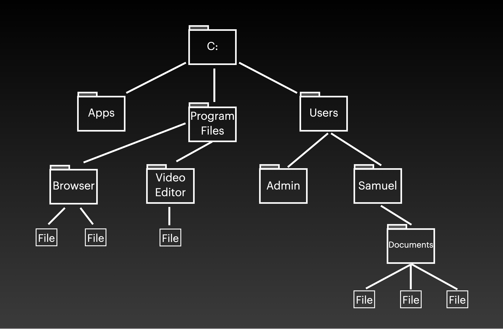
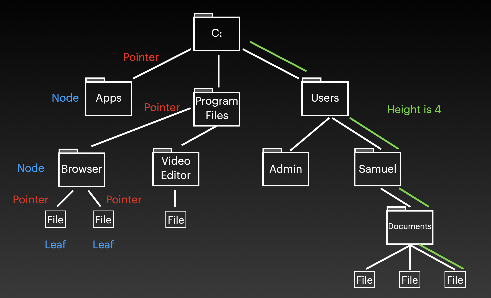
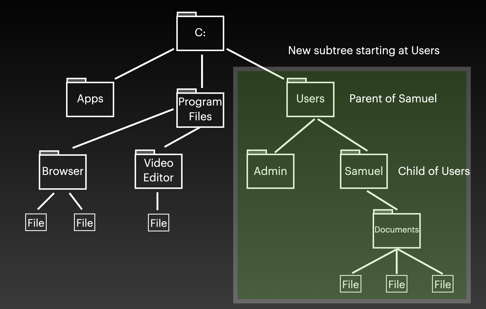
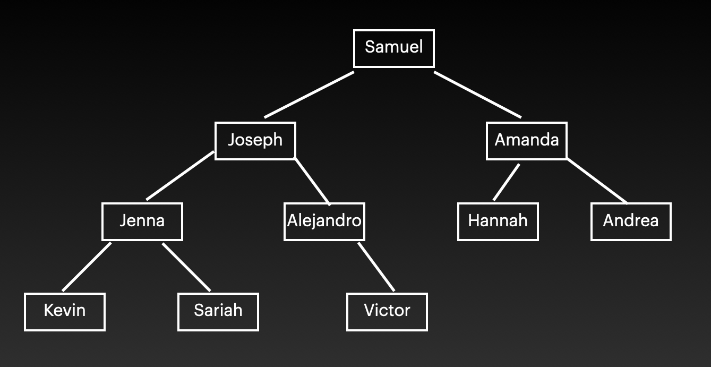
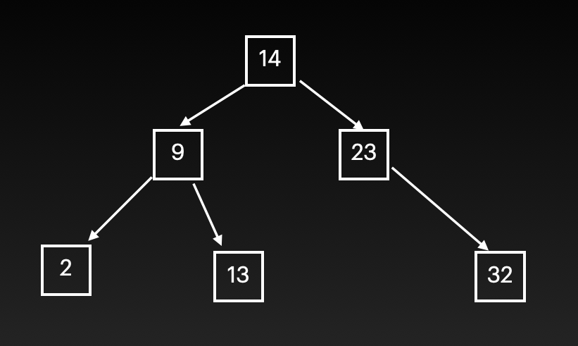
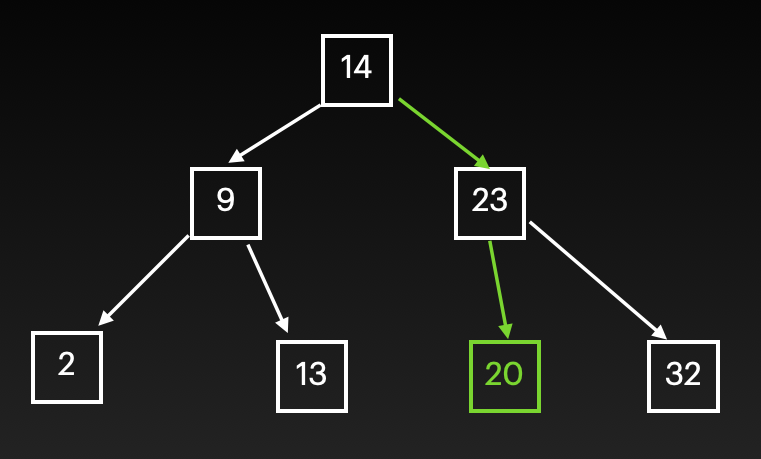
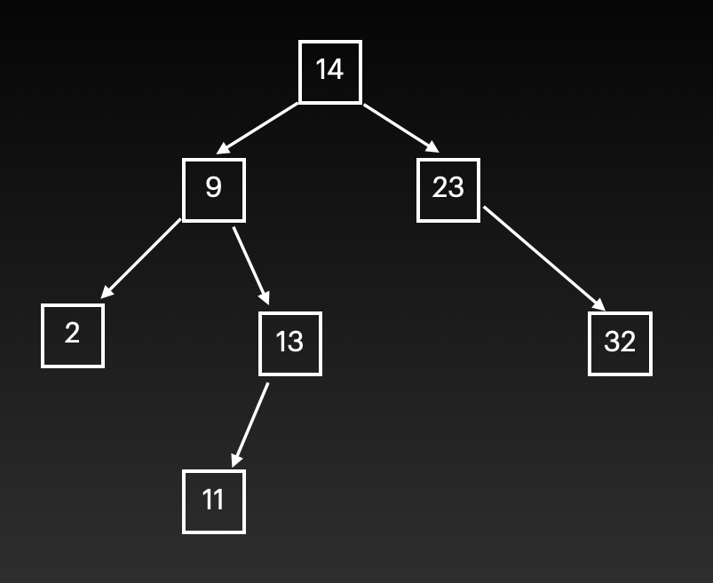
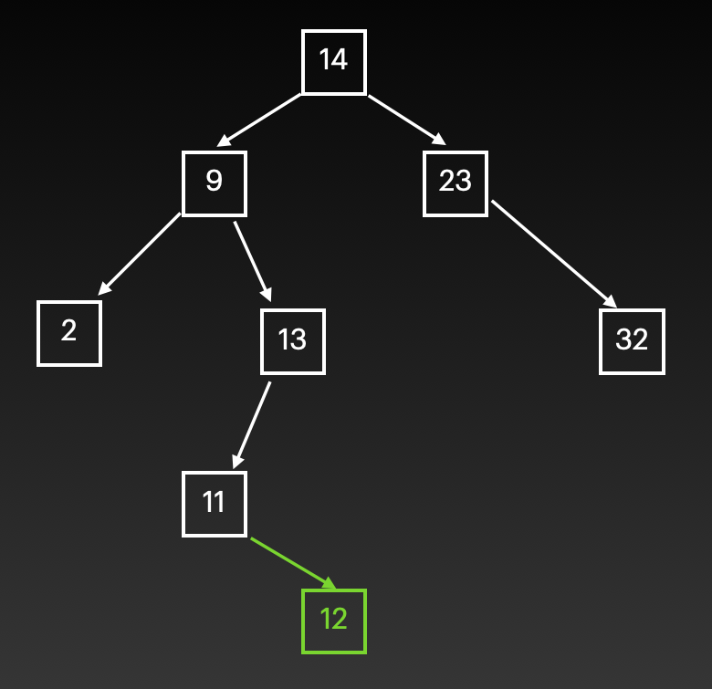
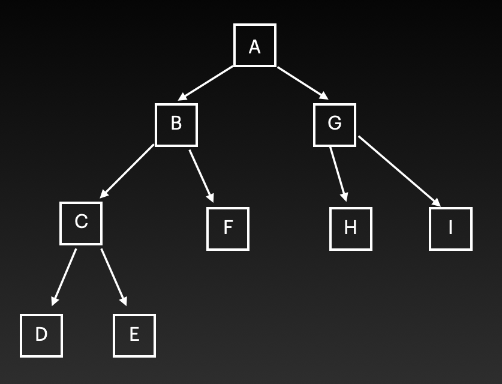
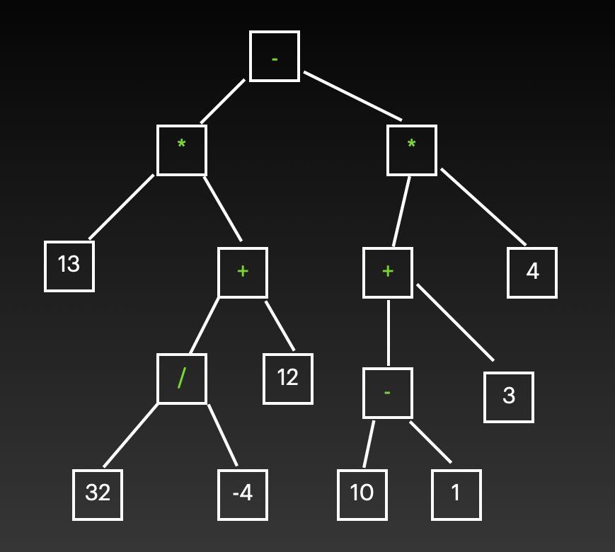

# Tree

## Introduction

It's time to talk about trees. Let's look at the next picture:



This image shows a part of a file system on a computer. The graph that we see is called a tree, and computer scientists have decided to use the same approach to store data, using trees as data structures.

The concept is that you have a root, in this case, the C: disk. From the root, connections are pointing to other folders. Those connections are called pointers, and the folders or destinations of those pointers are called nodes. In that way, you can move through a tree going from node to node following the pointers. For example, If you want to get to the Documents folder, you'll need to travel from C: to Users, move to Samuel, and then do Documents.

A node that has no connection to other nodes (not pointing to another one) is called a leaf, just like trees ending in leaves instead of continuing with branches. The distance between two nodes is the least amount of pointers that you need to travel to get from one node to the other. The level of a node is the distance between it and the root. The height of a tree is specified by the highest level of any node. In the picture, the height of the tree is 4, because that's the distance between C: and the files that are under the Documents folder.



Trees get a lot of terminology from their similitude to family trees. All the nodes, except the root, have parents. The parent of a vertex is the first node that you find going from that vertex to the root of the tree. In the example above, Program Files is the parent of Video Editor. If v is the parent of vertex u, then u is a child of vertex v. In that way, Samuel is a child of Users.

Sometimes, trees are too big and it becomes necessary to focus on a smaller part of the big tree. That's when subtrees are useful. A subtree is a smaller tree taken from a big tree. To get a subtree, just select a node, and set it as a new starting point. Now every pointer and node that are from that node to the bottom are part of the subtree.



## Binary Trees

Trees can have multiple pointers attached to their nodes, but they can get pretty complex over time. For explanatory purposes, we'll focus on Binary trees. A binary tree is a kind of tree in which each node is only connected to more two nodes. The graph of the file system that we have been using is not a binary tree because C: was connected to three folders, and Documents was connected to three files. Because of that, let's use another example instead.



This other example satisfies the maximum number of other nodes connected to a node. It never gets higher than two. Also, it's ok to only be connected to one more node instead of two, just like Alejandro is connected to Victor only in this tree.



In this tree, the rule is that the node that is greater than the current node will be put on the right side, and the node that is lesser than the current node will go on the left side. That's why 9 is left and 23 is right from 14.

The same rules apply when we try to insert information into the tree. Imagine that you're trying to insert the number 20 into this tree. You'll have to follow something like this so you don't break any rules:
- Compare the number 20 to the value that is in the root.
- If 20 is greater than that value, move to the right side and visit that node. If it's lesser, move to the left and visit that node.
- Repeat starting at the new node you're at.

After follwing that process, your updated tree looks like this:



Because you're always dividing the amount of data by two, this process can be done in O(log n) time. That's only possible, though, when the difference in height between two subtrees is not very different. Or in other words, the tree is a Balanced Binary Search Tree.

## Balancing a tree

There are many algorithms out there to identify if a tree is unbalanced and then balance it. For this example, let's use the Adelson-Velskii and Landis algorithm, or AVL. In summary, this algorithm takes a node that is making the tree unbalanced and tries to put it on top of other two nodes, so the difference in the heights of the subtrees decreases. Let's check this BST for example:



We can consider this tree as balanced. The level of node 11 is 3, and the level of node 32 is 2, so there's no substantial difference in heights. But let's see what happens if we want to add a 12 to the tree.



After following the steps to add a new node, we end up that 12 needs to be the child of 11. But now, the level of 12 is 4, and the level of 32 is still 2. That is starting to look unbalanced, and if not controlled, it can lead to a performance drop as we add more and more information to the tree.

The AVL algorithm will go to that 12 and will try to see if it's possible to put it before and make other nodes its children, and in that way, reduce the height of that subtree. The algorithm will see that it's possible to take the 12 and make it a parent of 11 and 13. By doing that, now the level of each of its children will be 3, which is closer to the level of 32 which was 2. Now, the tree looks balanced again.

## Operations and performance

**inset(value):** Adds the specified value to the tree. Its performance is O(log n) because every time the tree is becoming smaller and smaller as the process is executed recursively.

**remove(value):** Deleted the specified value from the tree. Its performance is also log(n) applying recursion.

**contains(value):** Checks if the value is part of the tree. Just like the operations above, its performance is O(log n) because of recursion and making the problem smaller each time.

**traverse:** This could be forward if it's going from smallest to greatest, or reverse if it's going from largest to smallest. Its performance is O(n) because it needs to visit each node in the tree.

**height(node):** Gives you back the height of a node, or of the entire tree by using the root. Its performance is O(n) because it needs to visit each node to check all the different levels and return the greatest height.

**size():** Returns the size of the BST. It's O(1) because the class that implements the BST will always keep track of its size. You could also use this operation to check if the BST is empty by checkign the size for 0.

## Example code

A good way to use binary trees without importing any library is by using nested lists. You can represent this tree by using nested lists.



```python
tree = ['a', ['b', ['c', 'd', 'e'], 'f'], ['g', 'h', 'i']]
```

Check the list thats inside of the tree list:

```python
tree = ['g', 'h', 'i']
```

The first element is the parent of the other two. The second element is the child on the left, and the third element the child on the right side of the parent.

Now, let's convert a nested list to the tree graph. This is the list:

```python
tree = ['-', ['*', 13, ['+', ['/', 32, -4], 12]], ['*', ['+', ['-', 10, 1], 3], 4]]
```

After a couple of minutes of pain, you should get the following tree:



In this tree, the numbers are leaves, and you have operations as nodes. The parent node of two children will apply the sign operation to its children. If one of the children is another operation, then you'll use parentheses and complete the operations that are deeper first. The mathematical result of this tree would be:

```python
result = 13 * (-32/4 + 12) - 4 * (10 - 1 + 3)
print(result)
```

When done properly, the result of these operations is 4.

## Challenge time

Your challenge this time is to create a function that will evaluate the result using the same tree that I used to calculate that result by hand. So, your function should return a 4. You'll need recursion to solve this problem. And also, the isinstance() function could be helpful to determine what is a number and what is an operator. Don't worry too much about trying to solve the problem in all the cases. Just worry to get the number 4 as an answer for this problem.

```python
tree = ['-', ['*', 13, ['+', ['/', 32, -4], 12]], ['*', ['+', ['-', 10, 1], 3], 4]]

def evaluate_tree(t):
    """
    Write your code here
    """
    pass

result = evaluate_tree(tree)

print(result)   # Should print a 4.0
```

Here's my solution to this challenge:

[Solution](code/tree_challenge_solved.py)

