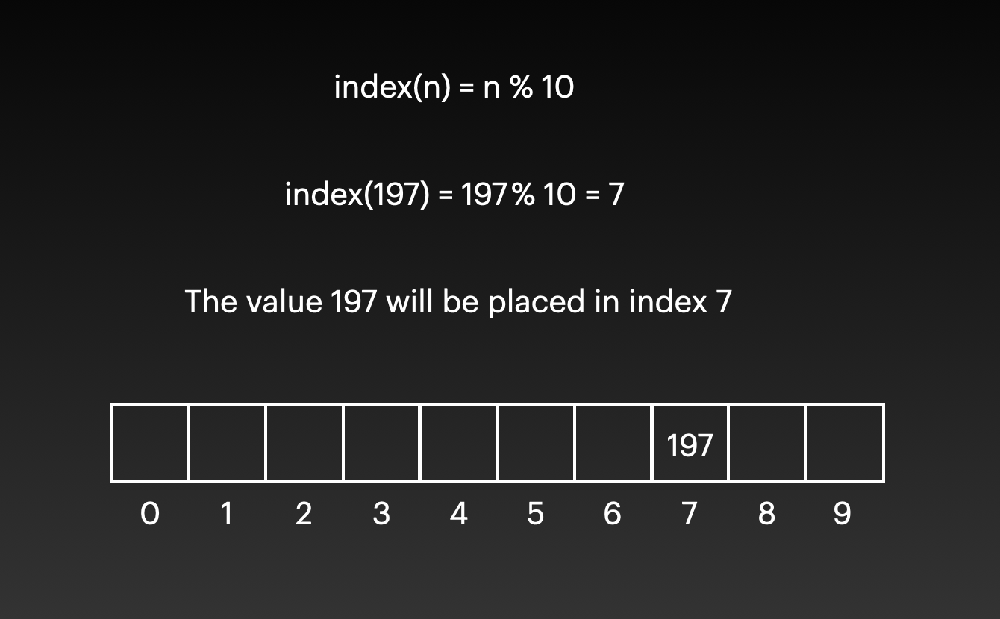
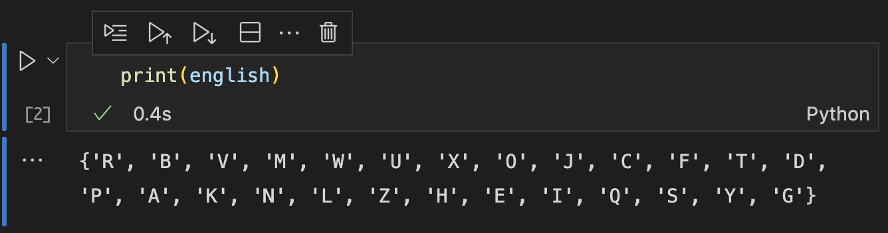
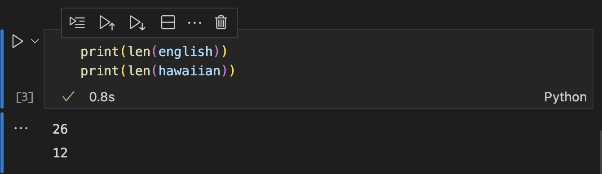
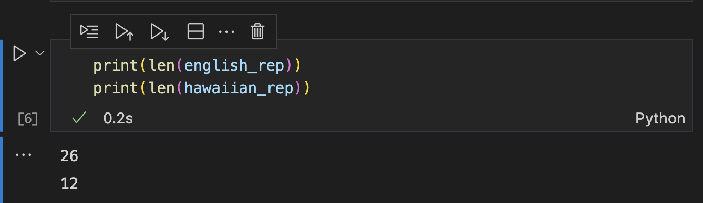

# Set

## Introduction

You've seen them before and you enjoyed them a lot. Sets are back to stay! The same principles that we learn in math will be applied to sets in programming, and that's because they're so awesome to only be part of math.

## Definition

Set is a data structure that lets you store all kind of values without paying attention to the order in which they are stored. You'll like and resent them a lot because of that characteristic.

You may be familiar with lists (arrays), but it's worth noticing that sets are different from lists. Sets allow no duplicates and have no order. If you try to add a duplicate, sets will just ignore what you just did and keep only one of the instances. With the order, it will only care of keeping the things in the set without paying attention to the order. So, if you care about the order of the things you're storing, don't use sets.

## Hashing

Sets can store many things and perform operations to check and retrieve values in O(1). Yes, they're very efficient. That's something that doesn't happen in a list, where an operation like that would take O(n) time. To achieve O(1) efficiency while continue to allow many values in it, sets use hashing.

Hashing is transforming a value into a simpler one that will tell the set in what position we want to store our original value. There are many ways to get this position, but for this example we'll say that the position will be given by the modulus 10 of that value. Then, imagine that you want to store the number 197 in our set. If we apply our hashing formula we'll have that the position that the number 197 will ocupy in our set will be 197 mod 10, which is equal to 7.



In the example above there are only 10 positions to play with, and we know that you can get the same results for many numbers when you take its modulo 10. 

Hashing applications in real life are more complex, being able to hash not only integers but words and floats too. Python has a built-in hash function that we can use with that intent.

## Set operations

Programmers love sets becuase of the characteristics explained and its performance. The common operations of sets are performed in O(1) timea and are:

**add(value):** Adds the specified value to the set. The performance is O(1) because the computer only needs to do the hashing (one operation) once and place the value in the given position. In Python:

```python
my_set.add(value)
```

**remove(value):** Removes from the set the specified value. The performance is O(1), because for removing items, the computer just calculates the position of that value using hashing, and then goes to that position to see if it's there, and removes it if it is. In Python:

```python
my_set.remove(value)
```

**member(value):** Checks if the specified value is part of the set. The performance is still O(1), because for doing this the computer will do the hashing and go straight to that position. If the value is there, it will return True. In Python you can use it as a condition:

```python
if value in my_set:
```

**size():** Returns the size or amount of items that are in the set. It's O(1) becuase just like with the stacks, Python will keep track of how many things you have in the data structure all the time. In Python you can use the len() function:

```python
length = len(my_set)
```

## Example code

Because sets don't allow duplicates we can use them to compare different alphabets. The English alphabet has 26 letters in it, and the Hawaiian has 12. Let's put those in Python sets.

```python
english = set("ABCDEFGHIJKLMNOPQRSTUVWXYZ")
hawaiian = set("AEHIKLMNOPUW")
```

Using set(), Python is taking those strings and converting each individual character to an element in a set. When we print one of those sets we can see that:



And we can check the size by using the len() function:

```python
print(len(english))
print(len(hawaiian))
```



What would have happened if we make a mistake in the string and repeat any of the letters? Here's an example with some repeated letters:

```python
english_rep = set("AAABCDEFFGHIJKLLLLLLMNOPQRSTUVWXYZ")
hawaiian_rep = set("AAAEHIKLMMMMNOPUW")
```



Because each character is being added to a set, and sets don't accept duplicates, the size of the alphabet with duplicates is the same as the one with no repetitions.

## Challenge time

Sets are very important topics of computer science that were taken from math. Implement two functions for finding the union and intersect of two sets. You can use the same english and hawaiian alphabets as a guide to solve this problem, but the functions should work for any two given sets. Don't hesitate to use the operations discussed above to write these functions.

```python

english_rep = set("AAABCDEFFGHIJKLLLLLLMNOPQRSTUVWXYZ")
hawaiian_rep = set("AAAEHIKLMMMMNOPUW")


def union(a, b):
    """
    returns the union of set a with set b.
    """
    pass

def intersect(a, b):
    """
    returns the intersect of set a with set b.
    """
    pass

union_alphabets = union(english, hawaiian)
print(union_alphabets)

intersect_alphabets = intersect(english, hawaiian)
print(intersect_alphabets)
```

Here's my solution to this challenge:

[Solution](code/set_challenge_solution.py)

