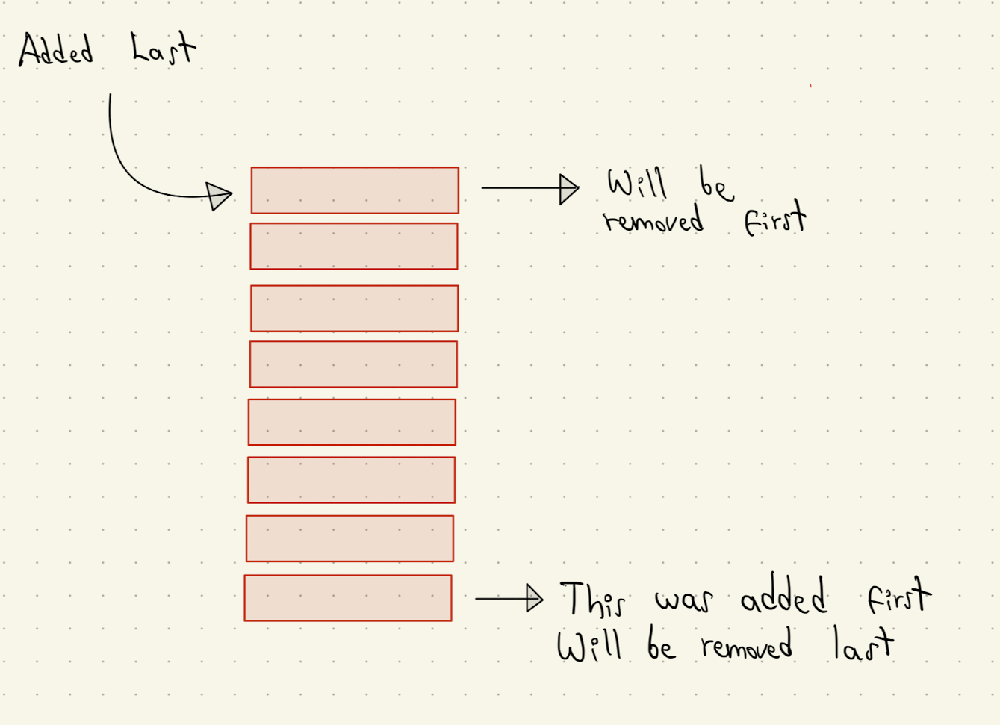
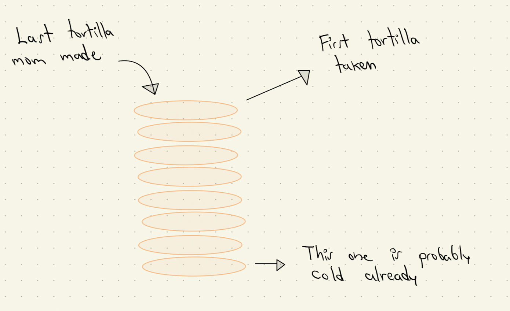
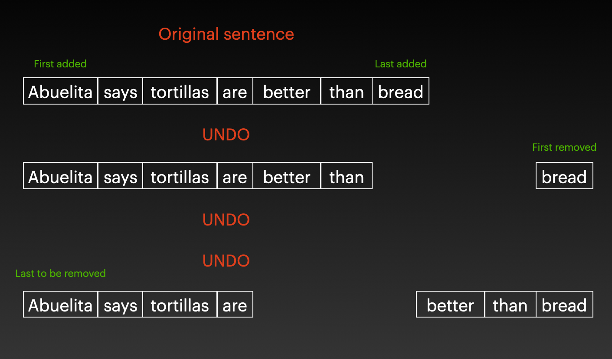

# Stack

## Introduction

The deadline is in two hours and you're writting that essay that you procrastinated for almost two weeks. Suddenly, when trying to go to your browser windows, your computer decided to select all the paragraphs and delete them. Fortunately, you know your computer shortcuts very well and use the undo a couple of times. Magicallym your complete essay is back as it was before the accident.

We're so lucky to have the undo and redo functions built into our software. But, what's the principle by which those functionalities work?

## Definition

Stack is the right answer, or at least the one I'll focus on today. A stack is a data structure, a way to store and mess with data, that follows an interesting order when performing operations to it. The order is LIFO (Last In First Out), or as some other people refer to it, FILO (First In Last Out). Check this picture I created to understand it better. I know it's not beautiful, but I paid $9 for GoodNotes, so I have to use it.



## Tortillas

Maybe looking at rectangles is a little boring, and that's why I think of stacks as tortillas. Imagine that your mom is making tortillas for dinner and all your family members are taking tortillas. The tortillas behave as a stack (a stack of tortillas), and follow the LIFO order. The first tortillas that your mom made is probably still on the bottom, whereas the new ones are on top. The person who grabs a tortilla is going to do it from the top, grabbing the one that was just recently made.



## Going back to undo

Sorry I talk about tortillas a lot. I was telling you that stacks are also used when you use undo in a program. In this case, you're writing a paragraph about your grandma.



You see that the things you're editing (in this case, the words your writing) are being added as a stack. The first thing that you wrote is going to the bottom of the stack, and the last thing to the top. When you perform an undo, the last word that you added will we deleted. If you want to remove the first thing that you added by using undo, you'll need to undo all the other things first. In that way, the undo is respecting the LIFO order and behaving as a stack.

## Operations and performance

Programmers love stacks because of its performance. Its operations perform in O(1), meaning that stacks are very efficient data structures. The most common stack operations are:

**push(value):** Adds a new element to the stack. It's when your mom adds the tortilla to the top of the other tortillas. It's O(1) because she doesn't need to touch or change the order of the other tortillas to do that. The new element is just put on top of the others. In Python:

```python
stack.append(value)
```

**pop():** Removes the element thats on top of the stack, and also returns it. It's similar to when someone from your family takes the tortilla that's on top of the other ones. It's O(1) because that person only needs to grab the tortilla on top, without messing with the other tortillas.  In Python:

```python
stack.pop()
```

**size():** Returns the size of the stack. It's O(1) because Python keeps track of the size of the stack and every time you update something the size is also updated, so it doesn't need to count it every time. In Python:

```python
size = len(stack)
```

## Example code

Another common operation for stacks is peek. This operation only returns, without removing, the top element of a stack. Let's see if we can implement a function to do that.

```python
tortillas = [1, 2, 3]
```

That's our stack with three tortillas. We only want to check what's the element that's on top without messing with any of the others.

```python
def peek(tortillas):
    if len(tortillas)!= 0:
        return tortillas[-1]
    else:
        return None
```

We're passing the stack of tortillas as our argument. Of couse, this would work for any other stack but I decided to use tortillas instead to make it more specific.

The peek() function is checking if there's something in the stack. If there is, it will return the last element by using the -1 as the index position. If the stack is empty, it will return nothing because there's nothing on top either. We could have also used pop() to get the item that's on top, but that would have deleted the item from the stack, and we only wanted to check what the item was, not delete it. This function runs in O(1) time too, because it doesn't matter how large the input is, you're only checking the last one.

## Challenge time

For this challenge, you'll have a tortillas list. That list will consist of numbers representing those tortillas. The tortilla that was added last will have the greatest number. You'll implement two functions. The make_tortilla() will add a tortilla on top of all the others. The take_tortilla will take the tortilla that's on top of all the others and return it.

```python

# Stack with three tortillas

tortillas = [1, 2, 3]

def make_tortilla(tortillas):
    """
    Adds a new tortilla to the top of the tortillas stack.
    """
    pass

def take_tortilla(tortillas):
    """
    Deletes the tortilla that's on top of the tortillas stack and returns it.
    If the stack is empty, it should return a message saying that it's empty.
    """
    pass


### TESTS ###

make_tortilla(tortillas)
make_tortilla(tortillas)
print(tortillas) # [1, 2, 3, 4, 5]
top_tortilla = take_tortilla(tortillas)
print(top_tortilla) # 5
print(tortillas) # [1, 2, 3, 4]
take_tortilla(tortillas)
take_tortilla(tortillas)
take_tortilla(tortillas)
take_tortilla(tortillas)
take_tortilla(tortillas) # Message saying that there are no tortillas left.

```

Here's my solution to this challenge:

[Solution](code/stack_challenge_solved)


